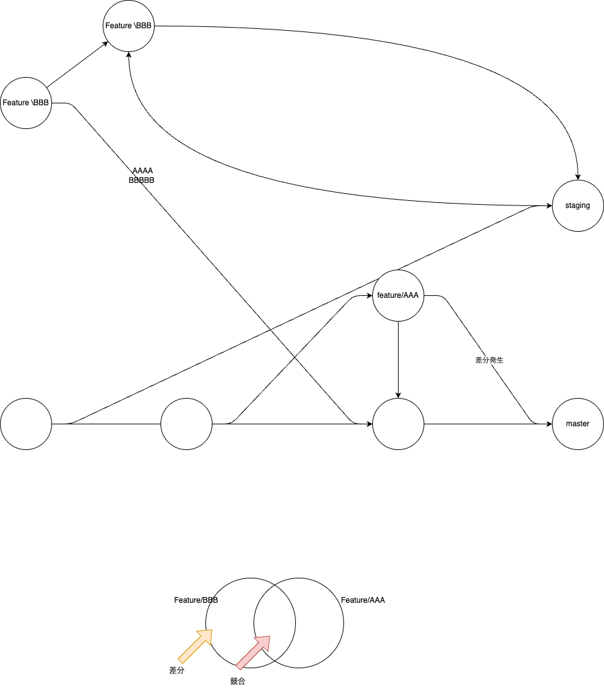

# GitHub運用ルール

## 概要


## 手順
```
# 01 masterからチェックアウト
git checkout -b feature/AAA origin/master

# 02 fetchしてMaster同期してfeature/AAAに取り込まれる
git checkout master
git fetch
git pull origin master
git checkout feature/AAA
git merge master

# 03 Local内で開発

# 04 対象ファイルcommit -> push
git checkout master
git fetch
git pull origin master
git checkout feature/AAA
git merge master

# 修正ファイル全部の場合
git add .

# 修正ファイル指定の場合
git add aaa/bbb/sample.html

git commit -m "XXXXXX"
git push origin feature/AAA
```


