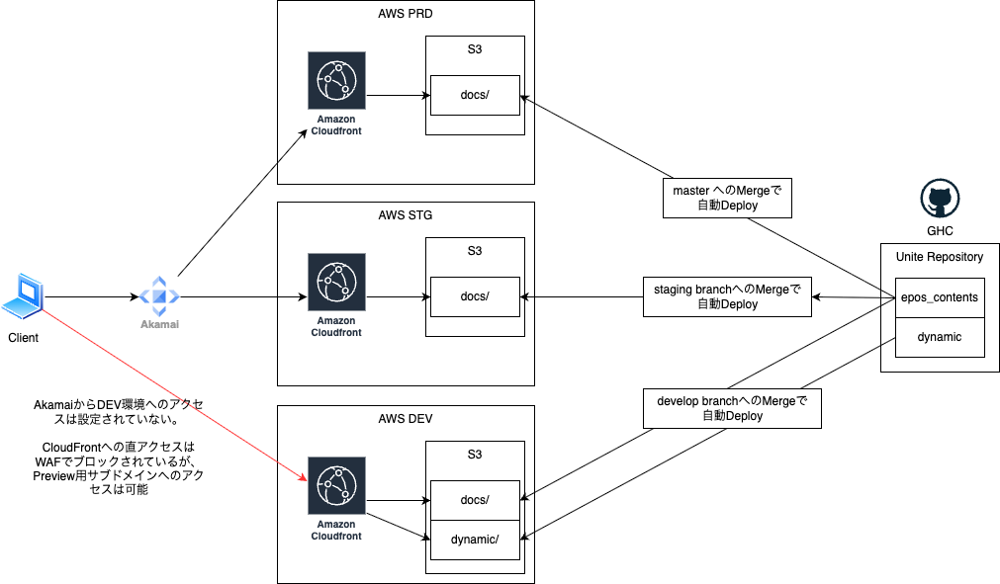

# 今後の Dynamic 開発方針

## AS-IS（現状）

- AMBL 管理下の AWS 上に Web サービスを立ち上げ、動作確認を実施したうえで、成果物を GHE へ納品している。
- 開発途中のソースコードについては GitHub 上での管理を行っておらず、各担当者のローカル環境のみで管理している。

## TO-BE（今後の方針案）

- `dynamic` 用リポジトリを GHC 側に新規作成する。
- UNITE 管理下の AWS 上で、現在 `docs` 配下を S3 ホスティングで公開しているのと同様に、`dynamic` 配下も S3 ホスティングで公開する。
- Branchに`develop`を追加し、`develop`に対してMergeされることをトリガーに、AWS DEV環境に自動デプロイを行う。

    ※ AWS STG, AWS PRDへのdynamicは作成しない

### 補足

- `develop` Branchを新たに追加することで、PR作成先が増えてしまうため作業が少し増加する。 
※`staging` BranchへのMergeをトリガーにDEV環境へも自動デプロイすることも可能
- `dynamic` は JSP へ変換する前段階の HTML 資材であり、静的コンテンツとして S3 ホスティングしても問題ない。
- `dynamic` は `docs` の資材を参照する必要があるため、`docs` へのパスが解決できる位置に配置することを前提とする。
- `CloudFront`への直アクセスは不可となっているため、ブラウザー拡張ツールもしくはローカルプロキシ経由でHttpHeaderに`x-akamai-origin`を付与する必要がある。

    ※Akamai経由でアクセス可能な`dynamic`用のサブドメインを払出し可能であれば不要

    ブラウザー拡張ツール例：ModHeader

### 構成概要
