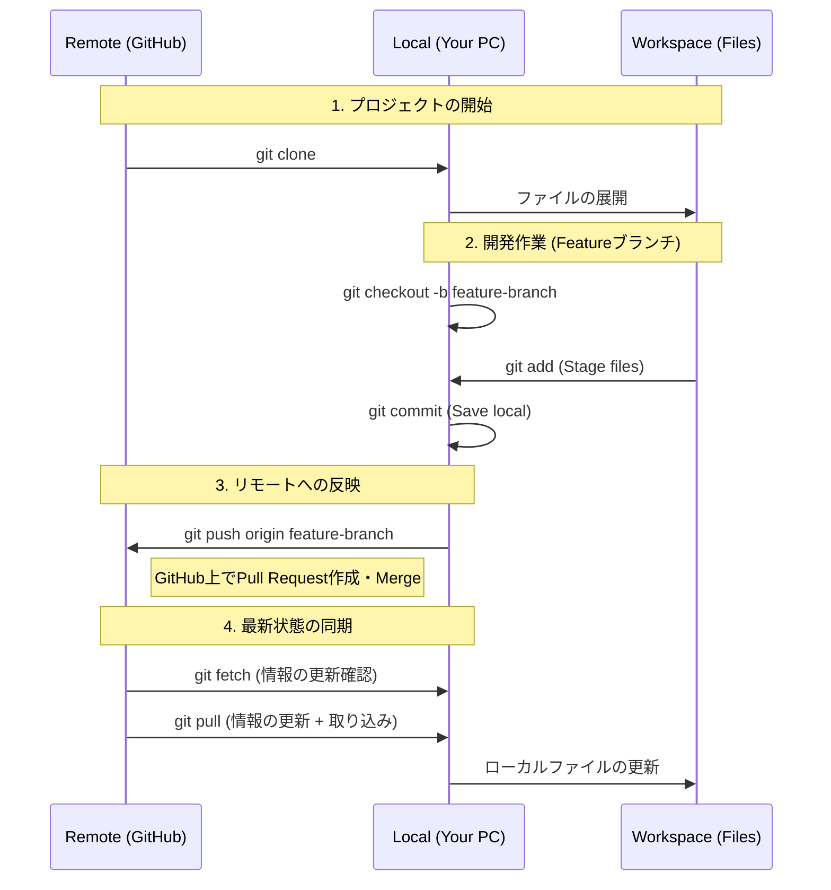
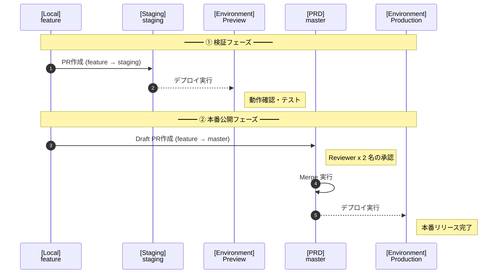
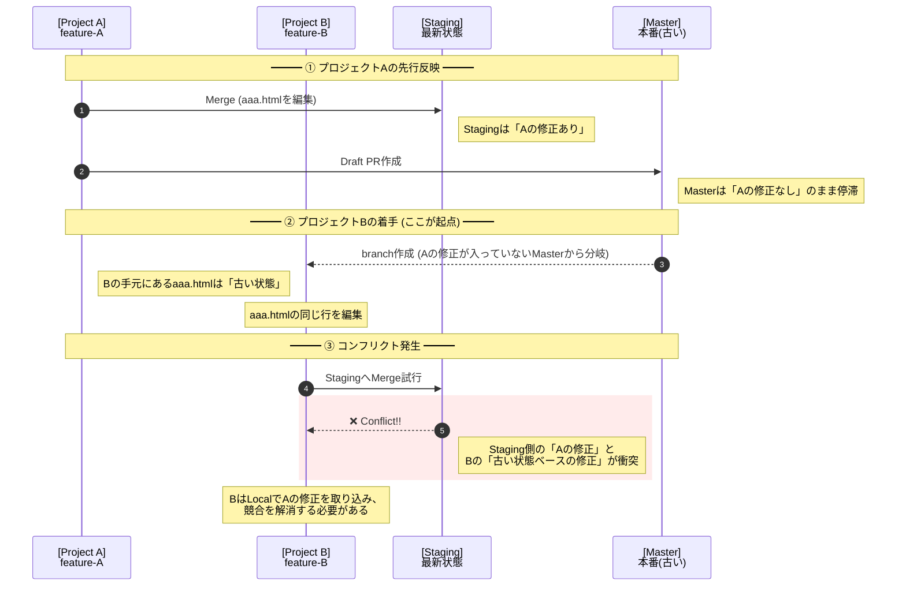

# 業務で使うためのGitHub基礎知識

## GitHubとは

ソースコードなどを含むファイルの変更履歴を管理することを、バージョン管理と言います。

バージョン管理をしていれば、ファイルの追加・変更・削除といった履歴をたどることで、過去のバージョンに戻したり、どのタイミングから不具合が発生したのかを把握することができます。

逆に、バージョン管理をしていない場合は、
- バグがいつから発生したのか
- どのファイルに何を追加・変更したことが原因なのか

といった情報を追いかけることが難しく、以前の状態に戻すことも非常に困難になります。

Gitは、このようなバージョン管理を行うための分散型バージョン管理システムです。

開発者は自分のローカル環境でコードを編集し、その履歴をGitで管理します。

そして、GitHubはそのGitのリポジトリをWeb上でホスティングするサービスで、
ローカルで管理しているコードをGitHubにアップロード（プッシュ）することで、複数人での共有や共同開発をしやすくします。

---

## GitHubリポジトリ操作の全体図

### 各工程の概要説明
| コマンド | 内容 | データの流れ |
| - | - | - |
| clone | リモートからリポジトリを丸ごとコピー ※初回のみ | Remote -> Local |
| checkout | 新しい作業用Branchを作成(Feature) | Local内での操作 |
| commit | 変更をローカルリポジトリに記録（この時点ではGitHubに反映されていない） | Workspace -> Local |
| Push | ローカルの変更をGitHubのリモートリポジトリへ送信 | Local -> Remote |
| Merge | GitHub上でFeature BranchをMain/Master Branchへ統合 | Remote内での操作 |
| fetch | リモートの最新状態を確認する（ファイルは書き換わらない） | Remote → Local (情報のみ) |
| pull | リモートの変更を取得して、今の作業ファイルに合体させる | Remote → Local → Workspace |

### 運用ルール

__1.Feature ブランチ__

- __役割:__ 作業用ブランチ

- __運用フロー:__ 必ず`master`から作成する

__2.staging ブランチ__

- __役割:__ 検証環境（Stage）用ブランチ。

- __運用フロー:__ feature → staging へプルリクエスト（PR）を作成。

- __自動化:__ PR作成をトリガーとして、プレビュー環境が自動構成される。本番反映前の最終確認用として使用。

__3. Master ブランチ__

- __役割:__ 本番環境（Production）用ブランチ。

- __運用フロー:__ feature → master（またはmain）へ、まずは Draft PR として作成。

- __マージ条件:__ 
    - 1. 2名以上のエンジニアによる Review & Approve が完了していること。
    
    - 2. マージをもって本番環境へのデプロイ・公開とする。

### コンフリクトについて

__現状__

- __1.Staging:__ 先行する「プロジェクトA」の変更がマージされ、最新の状態になっている。

- __2.Master:__ 「プロジェクトA」がレビュー中（Draft PR）のため、まだ古い状態のまま。

- __3.プロジェクトB:__ 古い `master` 

ProjectBが持っているベースコード（古いMaster）と今のStagingのコードが違うため、どちらを優先すればいいか、両方取り込む必要があるか問われる。

公開時期に応じて、`master`へのPR作成及びコンフリクト解消を行う必要がある。

## Files Changedが大量発生する仕組み

__1. 原因：古いベースコードからの分岐__
原因は、master などのベースとなるブランチが更新されているのに、ローカルのベースコードを更新（Pull）せずに新しいブランチを作成したことにあります。

- __Gitの挙動:__ GitのPR（Pull Request）に表示される「Files Changed」は、「マージ先ブランチ（最新）」と「自分のブランチ」の差分ではありません。

    正しくは「自分のブランチが分岐した時点」から「今の自分の状態」までの全ての変更を表示します。

- __発生の仕組み:__ 自分のローカルにある古い `master` には、他人がすでに行った修正（Commit Log）が含まれていません。

    そのため、そのまま作業してPRを出すと、「他人の過去の修正」までもが「あなたのブランチで新しく発生した変更」としてカウントされてしまいます。

__2. 解決策：ベースコードの同期__

修正作業を始める前に、必ずベースとなるブランチを最新の状態に合わせる必要があります。

- `git fetch` & `git pull` を行い、リモートの最新コミット履歴をローカルに取り込む。

- 「最新状態」から、新しい `feature` ブランチを切り出す。

## 用語集
GitHubを利用する上で知っておきたい用語

| 用語 | 意味 |
| - | - |
| Repository | Projectの「箱・フォルダ」 ソースコードとその変更履歴をまとめて保存する場所。 |
| Local Repository | 自分のPCの中にあるRepository。 開発者が手元で編集・コミットする場所。 |
| Remote Repository | GitHub上にあるRepository。 チームで共有するための場所。 |
| Commit | 変更内容を「スナップショット」として保存する。 メッセージとセットで履歴に残る。 |
| Commit Message | コミットで「何を」「なぜ」変更したかのメモ。 |
| Branch | 作業用の枝。 main / master から枝分かれして、機能追加や修正を個々に進める。 |
| main / master | 基本となるBranch。 多くの場合、「本番公開」しているソースが置かれる。 |
| Feature Branch | 新機能や改修のために切る作業Branch。 |
| Merge | Branchの変更内容を別のBranchに取り込む。 |
| Clone | GitHub上のRepositoryを自分のPCにコピーすること。 |
| Pull | Remote Repositoryの最新の変更をLocal Repositoryに取り込むこと。 |
| Push | LocalでCommitした変更をRemote RepositoryへUploadすること。 |
| Fetch | Remoteから最新履歴を取得する。 |
| Cherry Pick | 特定のBranchの特定のCommitだけを別Branchへ取り込む。 |
| Reset | Stage、変更を全て破棄して指定のコミットまで戻す。 |
| origin | DefaultのRemote Repositoryの名前。  "origin/main"などで使う。|
| Pull Request(PR)| Branchの変更を取り込んでいいかReview、Merge依頼する仕組み。 |
| Review | PRの変更内容を他のメンバーがチェックし、コメントや承認を行う |
| Issue | 課題・バグチケットを管理する機能。 |
| Diff | 変更前と変更後のファイルの違いを示したもの。 |
| Confrict | 複数人が同じ箇所を別々に変更し、Gitが自動でMergeできなくなる状態。 |
| Revert | 指定したコミットの変更を“打ち消す新しいコミット”を作成して取り消す操作。 StagingやMasterなどへMergeした際に、Bugが混入して戻したい場合などに使われることが多い。 |
| .gitignore | Gitで管理しないファイルを指定する設定ファイル。 |
| Tag | Commitに印をつける機能。 リリースバージョンなどに使われることが多い。 |
| Release | タグを基にした「配布パッケージ」。 バージョンごとの成果物やリリースノートをまとめる単位。 |