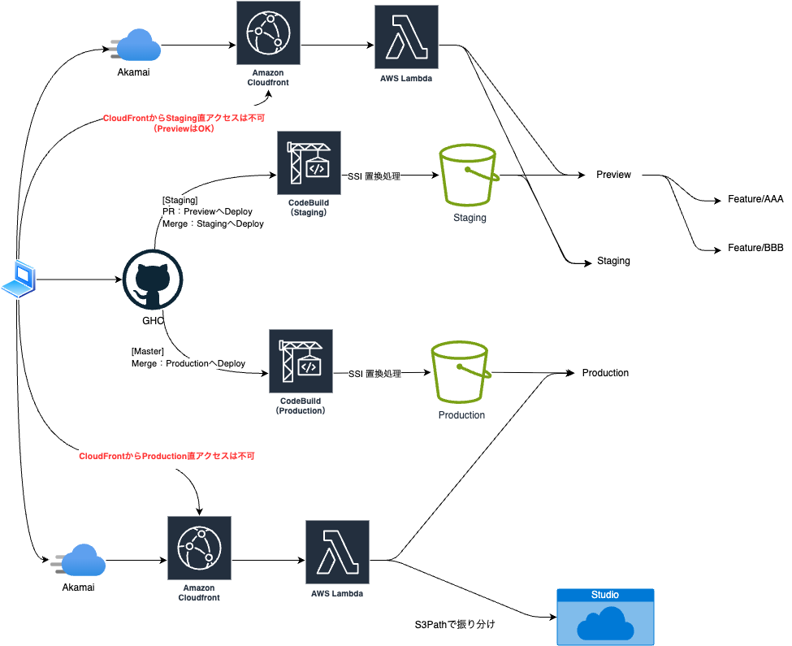

# S3 ホスティングサービス構成概要

## 概要
ネット担当では、大きく分けて動的と静的のコンテンツ開発があります。

静的コンテンツは、S3ホスティングサービス上、動的コンテンツはWebLogic上でJava（JSP）が動作し、それぞれ納品方法が異なります。

__動的コンテンツ（dynamic）：Git Hub Enterprise（GHE）__ 
OIOIネットワーク（6Fのセグメント）からのアクセスもしくはVPNが必要 
将来的にはGHCにリポジトリを作成して、GHC管理に一本化する

__静的コンテンツ（static）：Git Hub Cloud(GHC)__ 
Githubアカウントおよび、Organizationに含めてもらえれば使用可能 
GitHubActionsおよびCodeBuildを使用してしてCI/CDで自動Deploy

| ENV | Domain | Remarks |
| - | - | - |
| Production | www.eposcard.co.jp | - |
| Staging | epsstg20.eposcard.co.jp | - |
| Preivew | *.preview-static.stg.epos-app.com | ワイルイドカードはBase32化されたS3Path PR内のBotコメントで確認可能 |

