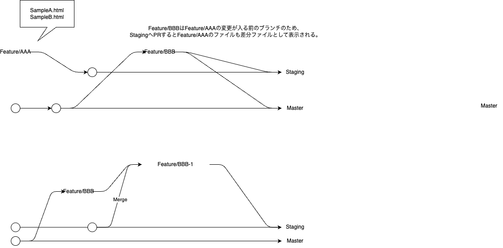

# コンフリクトが発生した時の手順

## 想定される場面
`Feature/AAA` → `Staging`へPRを作成

`Feature/AAA` → `Master`へPRを作成

`Staging`へのPRでコンフリクトが発生する場合がある。<br>
発生理由として、Feature Branchは`Master`から作成するため、`Staging`にあって`Master`に無い差分が大量に存在する。そのため、`Staging`だけ反映されたファイルがコンフリクト対象となる。



## 解決方法
`Feature/AAA`から`Feature/AAA-stg`と新たにBranchを作成し、StagingとMergeさせることでコンフリクトを発生させる。コンフリクト対象ファイルを修正して同BranchにPushすることで解消される。<br>
その際、最初に作った`Feature/AAA` → `Staging`へPRを<span style=color:red>Close</span>して、<br>
新たに`Feature/AAA-stg` → `Staging`へPRを作成する

## 例
```
****************************************
MasterへのPush
****************************************
# MasterへのPR用のBranch作成
git checkout -b AAA origin master
git add .
git commit -m "納品"
git push origin AAA

****************************************
Stagingコンフリクト解消手順
****************************************
# StagingへのPR用のBranchをAAAから作成
git checkout -b AAA-stg origin AAA

# リモートからログ取得
git fetch

# localにStagingがある場合
git checkout staging

# localにStagingがない場合
git checkout -b staging origin/staging

# Branch切り替え
git checkout AAA-stg

# stagingとMerge
git merge staging

****************************************
コンフリクト解消作業
****************************************

# コンフリクト解消後
git add .
git commit -m "コンフリクト解消"
git push origin AAA-stg

```